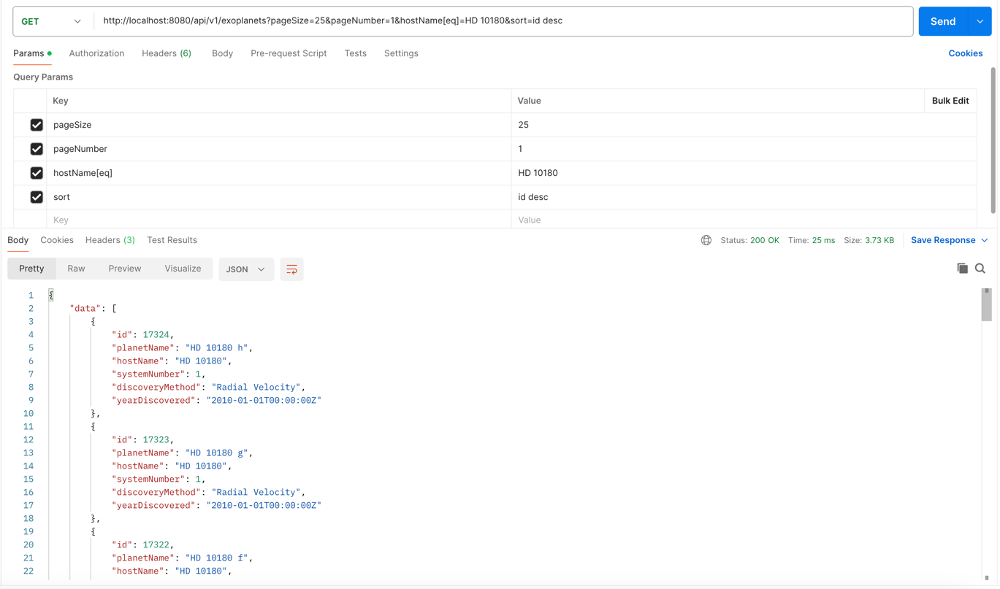

# Space API

A REST API that uses exoplanet data from NASA's Exoplanet Archive:
https://exoplanetarchive.ipac.caltech.edu/

## How to run the API locally

Prerequisites:
- Git
- Go 1.22
- Docker (to spin up an instance of Postgres)
- Task (to run commands in the taskfile.yml)

Run these bash commands:

```bash
git clone https://github.com/digitalsquid7/space-api
cd space-api
go mod vendor
task start-postgres
task start-api-locally
```

### Example API request


## What makes this API different

When you have a suite of REST API endpoints, you often want to allow the user to apply paging, sorting and filtering to 
the results of GET requests via URL parameters. The `sqlutil` package in this repository extracts paging, sorting and 
filtering parameters from the URL and applies those parameters to a base SQL query using `goqu`, an SQL string builder.

See `exoplanetsapi` for an example of how to utilise `sqlutil` to set up a new GET endpoint.

Additionally, the swagger docs are automatically generated from model definitions and doc strings using `swag`, which
makes keeping the swagger docs up-to-date nice and easy. To generate docs with `swag` run this bash command:

```bash
task generate-swagger
```
